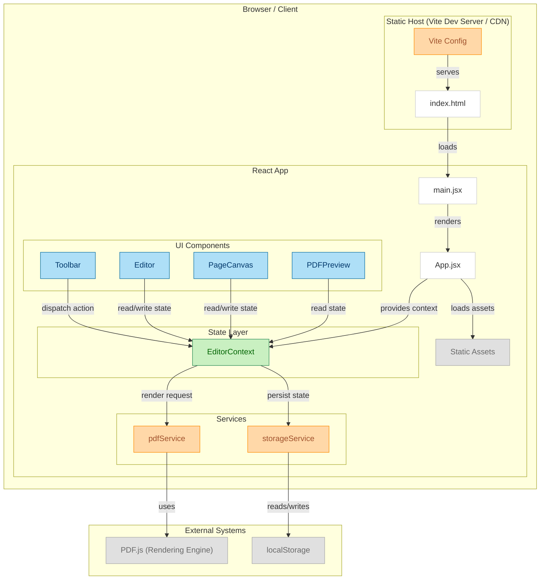

<!-- Documentation -->
---

# 📄 PDF Editor Project Architecture

This document describes the **frontend architecture** of the PDF Editor project and the  flowchart is given bellow. It explains the role of each module, how they interact, and the external dependencies involved.

---

## **1. Overview**

The PDF Editor application is a browser-based tool built with **React** and **Vite**. It enables users to edit, preview, and store PDF-related data in the browser. The architecture consists of:

* **Browser/Client Components** (React UI, State Management, and Services)
* **External Systems** (localStorage, PDF.js)
* **Static Hosting Layer** (Vite Dev Server/CDN)
## Architechure flowchart
[Flowchart](https://github.com/fThAbhishek-Pandey/pdfEditor/blob/main/docs/flowchartpdfEditor.png  "flowchart")

---

## **2. Architecture Diagram**
``` 
frontend/
│
├── vite.config.js               # Vite build & dev server configuration
├── index.html                    # Main HTML entry point
│
├── src/
│   ├── main.jsx                  # React entry point
│   ├── App.jsx                   # Root component & context provider
│   │
│   ├── contexts/
│   │   └── EditorContext.jsx     # Global state management
│   │
│   ├── components/
│   │   ├── Toolbar.jsx           # Editing tools UI
│   │   ├── PDFPreview.jsx        # PDF preview viewer
│   │   ├── Editor/
│   │   │   ├── Editor.jsx        # Main PDF editor interface
│   │   │   └── PageCanvas.jsx    # Canvas for rendering and editing pages
│   │
│   ├── services/
│   │   ├── pdfService.js         # PDF generation & rendering using PDF.js
│   │   └── storageService.js     # localStorage persistence
│   │
│   ├── assets/                   # Static assets (images, icons, etc.)
│   │
│   └── ...
│
└── ...

```

---

## **3. Modules & Components**

### **Static Host (Vite Dev Server / CDN)**

| Component       | Description                                            | Source                                                                                              |
| --------------- | ------------------------------------------------------ | --------------------------------------------------------------------------------------------------- |
| **Vite Config** | Configures the Vite development and build environment. | [vite.config.js](https://github.com/fthabhishek-pandey/pdfeditor/blob/main/frontend/vite.config.js) |
| **index.html**  | Entry HTML file served by Vite or CDN.                 | [index.html](https://github.com/fthabhishek-pandey/pdfeditor/blob/main/frontend/index.html)         |

---

### **React App**

#### **Main Files**

| Component    | Description                                                        | Source                                                                                      |
| ------------ | ------------------------------------------------------------------ | ------------------------------------------------------------------------------------------- |
| **main.jsx** | Application entry point; renders the `App` component into the DOM. | [main.jsx](https://github.com/fthabhishek-pandey/pdfeditor/blob/main/frontend/src/main.jsx) |
| **App.jsx**  | Root component containing global layout and context provider.      | [App.jsx](https://github.com/fthabhishek-pandey/pdfeditor/blob/main/frontend/src/App.jsx)   |

---

#### **State Layer**

| Component         | Description                                                               | Source                                                                                                                 |
| ----------------- | ------------------------------------------------------------------------- | ---------------------------------------------------------------------------------------------------------------------- |
| **EditorContext** | Provides global state for editor tools, canvas elements, and PDF preview. | [EditorContext.jsx](https://github.com/fthabhishek-pandey/pdfeditor/blob/main/frontend/src/contexts/EditorContext.jsx) |

---

#### **UI Components**

| Component      | Description                                          | Source                                                                                                                    |
| -------------- | ---------------------------------------------------- | ------------------------------------------------------------------------------------------------------------------------- |
| **Toolbar**    | User interface for editing tools and actions.        | [Toolbar.jsx](https://github.com/fthabhishek-pandey/pdfeditor/blob/main/frontend/src/components/Toolbar.jsx)              |
| **Editor**     | Main editing interface for manipulating PDF content. | [Editor.jsx](https://github.com/fthabhishek-pandey/pdfeditor/blob/main/frontend/src/components/Editor/Editor.jsx)         |
| **PageCanvas** | Canvas area where PDF pages are rendered and edited. | [PageCanvas.jsx](https://github.com/fthabhishek-pandey/pdfeditor/blob/main/frontend/src/components/Editor/PageCanvas.jsx) |
| **PDFPreview** | Displays a rendered preview of the final PDF.        | [PDFPreview.jsx](https://github.com/fthabhishek-pandey/pdfeditor/blob/main/frontend/src/components/PDFPreview.jsx)        |

---

#### **Services**

| Service            | Description                                              | Source                                                                                                                 |
| ------------------ | -------------------------------------------------------- | ---------------------------------------------------------------------------------------------------------------------- |
| **pdfService**     | Generates and renders PDF pages using PDF.js.            | [pdfService.js](https://github.com/fthabhishek-pandey/pdfeditor/blob/main/frontend/src/services/pdfService.js)         |
| **storageService** | Handles saving and retrieving state from `localStorage`. | [storageService.js](https://github.com/fthabhishek-pandey/pdfeditor/blob/main/frontend/src/services/storageService.js) |

---

#### **Assets**

| Type              | Description                            | Source                                                                                   |
| ----------------- | -------------------------------------- | ---------------------------------------------------------------------------------------- |
| **Static Assets** | Images, icons, and other static files. | [assets/](https://github.com/fthabhishek-pandey/pdfeditor/tree/main/frontend/src/assets) |

---

## **4. External Systems**

| System           | Description                                                          |
| ---------------- | -------------------------------------------------------------------- |
| **localStorage** | Browser storage for persisting editor state.                         |
| **PDF.js**       | JavaScript rendering engine used for displaying and processing PDFs. |

---

## **5. Data Flow**

1. **Vite** serves `index.html`.
2. `index.html` loads **main.jsx**, which renders **App.jsx**.
3. **App** initializes `EditorContext` and provides global state.
4. **UI Components** (Toolbar, Editor, PageCanvas, PDFPreview) interact with the state layer.
5. **pdfService** processes PDF rendering requests.
6. **storageService** persists state to `localStorage`.
7. **PDF.js** handles PDF rendering for previews.

---

---

This Markdown can be placed directly in a `README.md` or `ARCHITECTURE.md` for your repo.

---

If you want, I can also make a **GitHub-friendly version** where the Mermaid diagram **renders directly in README** and all links stay clickable without extra configs. Would you like me to prepare that next?
